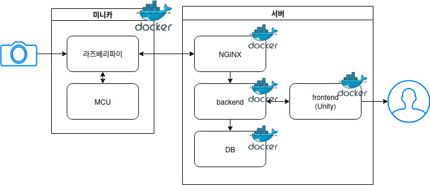

# :robot: Project Park Intel Sentinel

> **주차장 경비 로봇 시스템**  
ParkIntelBot은 주차장 경비 로봇이 주차장을 순찰하며 차량 번호판을 자동 인식하고, 장애인 주차 구역 및 전기차 충전 구역의 부적절한 주차 차량 발견 시 관리자에게 알림을 전송하는 **지능형 감시 시스템**입니다.
이 기능을 통해 주차 공간의 효율적인 관리와 특정 목적을 가진 주차 구역의 오남용을 방지할 수 있습니다.

#### 주요 기능

- 실시간으로 번호판을 인식하고 DB 등록 정보와 비교
- **장애인 주차 구역: 장애인 등록 차량 여부 확인**
- **전기차 충전 구역: 일반 차량이 점유하고 있는 상황**
- 관리자에게 알림 전송

#### 기대 효과

- 주차 공간의 올바른 사용 유도
- 주차 효율성 증대
- 주차장 관리 업무를 자동화하여 관리자의 신속한 대응

---

## 🧭 High Level Design

시스템 구성은 아래와 같습니다:



---

## 🔗 Clone code

```bash
git clone https://github.com/simeeeeee/park-intel-sentinel.git
```

---

## ⚙️ Prerequisite

프로젝트 실행을 위해 아래 환경이 필요합니다:

```bash
# 가상환경 생성
python -m venv .venv

# 가상환경 활성화
source .venv/bin/activate

# 의존성 설치
pip install -r requirements.txt
```

---

## 🛠 Steps to build

```bash
cd ~/park-intel-sentinel
source .venv/bin/activate

make
make install
```

---

## ▶️ Steps to run

```bash
cd ~/park-intel-sentinel
source .venv/bin/activate

# 데모 실행 예시
cd /path/to/repo/park-intel-sentinel/
python demo.py -i input_video.mp4 -m yolov8n.pt -d config.yaml
```

---


### 🧪 개발 환경 (Raspberry Pi 실기기 포함)

> Pi 장비에서 번호판 영역 crop + 이미지 전송, 나머지는 로컬 또는 EC2에서 AI추론 및 로직 실행

#### ✅ 백엔드/프론트 도커 실행

```bash
docker-compose -f docker-compose.dev.yml up --build
```

#### ✅ 라즈베리파이 구성

```bash
# Pi에 Docker 설치 후 SSH로 배포
ssh pi@<RPI_IP> 'bash -s' < ./deploy_edge.sh
```

또는 직접 실행:

```bash
cd ~/park-intel-sentinel/edge
git pull origin main
source venv/bin/activate
python3 run.py
```

## 📷 Output

프로젝트 실행 결과 예시:


---


## 📚 Appendix

- YOLO 모델은 `Ultralytics YOLOv8`을 사용
- 번호판 인식은 Tesseract OCR 기반
- 장애인 전용 구역 여부는 **지정된 주차구역 위치 데이터 + 차량 등록정보(DB)** 기반으로 판단
- 관리자 페이지는 Flask + SQLite3 기반
- MQTT 연동 기능은 향후 추가 예정

---

